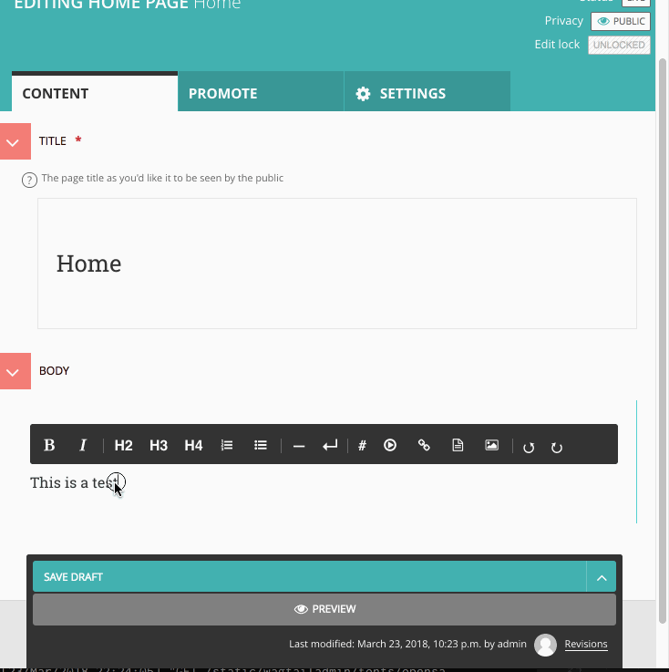
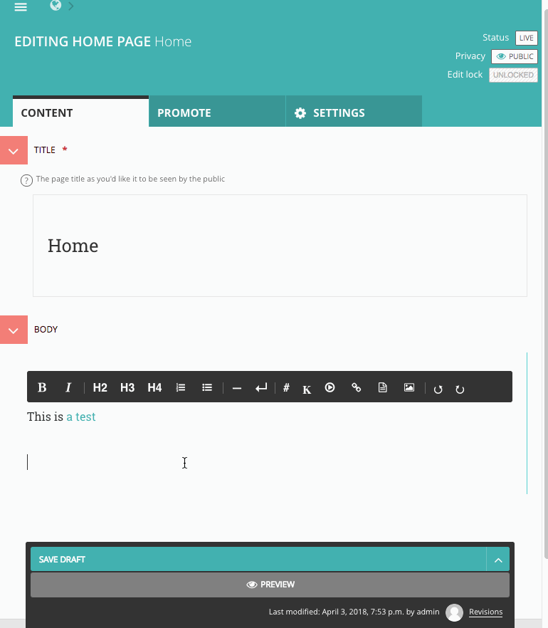

# Wagtail Draftail experiments

> 🚧 Experimental Draftail extensions for Wagtail 🐦

Related projects:

* [Draftail Playground](https://github.com/thibaudcolas/draftail-playground)
* [Draftail examples](https://springload.github.io/draftail/examples/)

## Experiments

### Anchor links

See [wagtail/wagtail#1049](https://github.com/wagtail/wagtail/issues/1049#issuecomment-375815036).

### KaTeX block

See [springload/draftail#145](https://github.com/springload/draftail/issues/145), and http://docs.wagtail.io/en/v2.0/advanced_topics/customisation/extending_draftail.html#creating-new-entities

